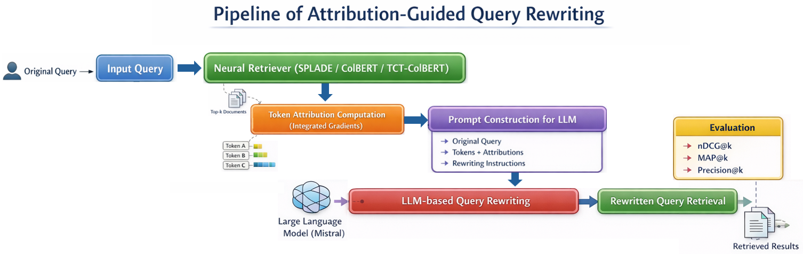
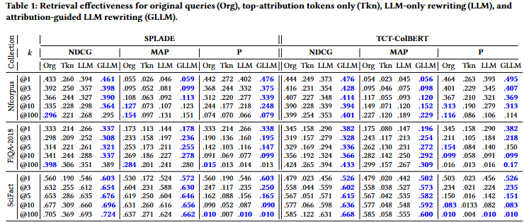
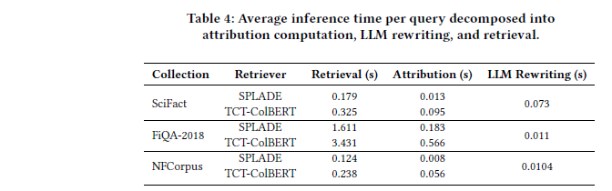

## Attribution-Guided Query Rewriting for Neural Information Retrieval

This repository contains the code, experimental setup, and supplementary analyses for our research work on **attribution-guided query rewriting** in neural information retrieval systems.

The core idea is to leverage **token-level attribution signals** (e.g., Integrated Gradients) computed *inside neural retrievers* to guide Large Language Models (LLMs) in rewriting user queries, with the goal of improving retrieval effectiveness while preserving faithfulness to the original information need.

---
## 🔍 Motivation

Neural retrievers such as SPLADE and ColBERT-based architectures achieve strong effectiveness, but remain sensitive to vocabulary mismatch, poorly specified queries, and ambiguous query terms.

At the same time, LLM-based query rewriting has shown promise, but often operates as retriever-agnostic, ignoring how retrieval models actually interpret queries.

**This work connects these two worlds** by:
- analyzing neural retrievers *from the inside* using attribution methods,
- identifying influential query tokens with respect to retrieval scores,
- and injecting these signals into LLM prompts to perform **retriever-aware query rewriting**.

---
## 📊 Experimental Results

### 1. Effectiveness
We evaluate our approach on [BEIR](https://github.com/UKPLab/beir), a standard neural IR benchmark. 
We focus on 3 representative datasets covering both open-domain and domain-specific retrieval: 
[SciFact]([https://www.cl.uni-heidelberg.de/statnlpgroup/nfcorpus/](https://github.com/allenai/scifact)) (5K docs, 300 queries), [FiQA-2018](https://sites.google.com/view/fiqa/) (57K docs, 648 queries), and [NFCorpus](https://www.cl.uni-heidelberg.de/statnlpgroup/nfcorpus/) (3.6K docs, 323 queries) representing scientific, financial, and biomedical domains.

We consider two representative neural retrieval approaches: hybrid sparse-dense (SPLADE)  retrieval and contextualized dense retrieval (TCT-ColBERT).
The table below reports the results obtained by our approach and baseline methods on three BEIR datasets. 

### 2. Efficiency 

While the primary focus of this work is on improving retrieval effectiveness, it is equally important to consider the computational cost introduced by our attribution-guided query rewriting pipeline.  In our approach, token-level attributions are computed directly during the standard retrieval operation, exploiting the internal representations already used for ranking, without requiring additional passes over the documents.   This design ensures that the extraction of attribution scores does not require additional passes over the corpus, thereby keeping the process efficient and practical for real-time retrieval scenarios.

Table 2 reports the average inference time per query for each component of our attribution-guided query rewriting pipeline, including neural retrieval, token-level attribution computation, and LLM-based rewriting. 

As observed, the time required to compute token-level attributions is relatively small compared to the total retrieval time. For instance, on SciFact, attribution extraction accounts for approximately 7% of the total SPLADE retrieval time (0.013s vs 0.179s) and about 29% for TCT-ColBERT (0.095s vs 0.325s). Similarly, LLM rewriting adds a minor overhead across collections, ranging from 0.0104s to 0.073s per query. 

Across all datasets, including larger collections such as FiQA-2018 where retrieval times are longer (1.611s for SPLADE and 3.431s for TCT-ColBERT), the additional cost of attribution computation and LLM rewriting remains modest relative to the overall pipeline. This demonstrates that the pipeline can generate attribution-guided query reformulations without incurring prohibitive latency.

---
