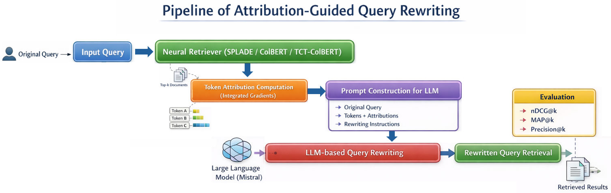

## Attribution-Guided Query Rewriting for Neural Information Retrieval

This repository contains the code, experimental setup, and supplementary analyses for our research work on **attribution-guided query rewriting** in neural information retrieval systems.

The core idea is to leverage **token-level attribution signals** (e.g., Integrated Gradients) computed *inside neural retrievers* to guide Large Language Models (LLMs) in rewriting user queries, with the goal of improving retrieval effectiveness while preserving faithfulness to the original information need.

---
## 🔍 Motivation

Neural retrievers such as SPLADE and ColBERT-based architectures achieve strong effectiveness, but remain sensitive to vocabulary mismatch, poorly specified queries, and ambiguous query terms.

At the same time, LLM-based query rewriting has shown promise, but often operates as retriever-agnostic, ignoring how retrieval models actually interpret queries.

**This work connects these two worlds** by:
- analyzing neural retrievers *from the inside* using attribution methods,
- identifying influential query tokens with respect to retrieval scores,
- and injecting these signals into LLM prompts to perform **retriever-aware query rewriting**.

---
